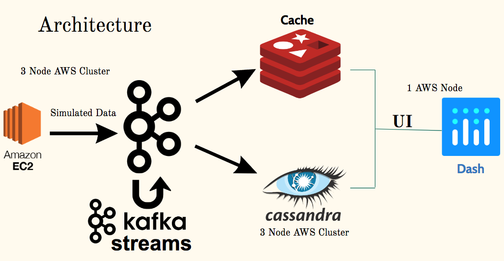

# Smart Meter Real Time Analytics
### Insight Data Engineering 2020
#### John Desmond

This is the main repository for my project using simulated smart meter data to create a real time dashboard allowing utility companies and their customers to analyze electricity data in real-time to save energy, detect outages, and suggest accurate and innovative pricing plans to customers.




## Table of Contents

1. [Purpose](https://github.com/yohn-dezmon/realtime-smart-meter-dashboard#purpose)
2. [Dataset Details](https://github.com/yohn-dezmon/realtime-smart-meter-dashboard#dataset-details)
3. [Instructions for cloning and setting up project](https://github.com/yohn-dezmon/instructions-for-cloning-and-setting-up-project)
4. [Kafka Producers, Streams, and Consumers](https://github.com/yohn-dezmon/realtime-smart-meter-dashboard#kafka-producers,-streams,-and-consumers)
5. [Cassandra and Redis Schemas](https://github.com/yohn-dezmon/realtime-smart-meter-dashboard#cassandra-and-redis-schemas)


## Purpose:  
The purpose of this pipeline is to process simulated electricity data from several thousand households into a single pipeline, in which real-time analytics can be applied to electricity data to benefit the utility companies and the customers.

## Dataset Generation Details:

I created three threads within a single Java Kafka producer, each of which generates a third of the simulated data. Each thread produces a certain range of GPS coordinates, which are then converted into geohashes for their efficiency in storage (and also for graphing purposes). Each Kafka producer also produces a timestamp for a given set of values, and assigns an energy value to each row based on a normal distribution. Ultimately these data represent 1 second interval readings from 10,000 homes in London, UK.  

Below is an atom of the data that the producer creates:
| TimeStamp | Geohash | Energy (kWh/s) |
|-----------|---------|----------------|
| 2020-01-30 01:32:58.989 | gcpuy8f1gwg5 | 0.000249 |


The simulated dataset is based on the [SmartMeter Energy Consumption Data in London Households dataset](https://data.london.gov.uk/dataset/smartmeter-energy-use-data-in-london-households).


## Instructions for cloning and setting up project:

### Creating clusters

To create the clusters I downloaded the [Pegasus](https://github.com/InsightDataScience/pegasus) package from Insight and followed the instructions found on the readme. Please clone pegasus onto your local computer and follow the instructions for setting up the AWS command line tool and peg command line tool.

After installing pegasus, I created one cluster called 'kafka' consisting of three nodes. This assumes you have already set up security groups, subnets and a VPC on your AWS account.
Below is the .yml file I used by calling peg up kafka3.yml


```
purchase_type: on_demand
subnet_id: subnet-063e9c687f2b28604
num_instances: 3
key_name: John-Desmond-IAM-keypair
security_group_ids: sg-0e03c7fd4dcd32839
instance_type: m4.large
tag_name: kafka
vol_size: 100
role: master
use_eips: true
```
I also created a cluster of three nodes for Cassandra called 'cassandra' using another .yml file and the same peg command.

Finally I created a standalone node called webserver by running another .yml file and changing the tag_name to webserver and the num_instances to 1.

### Starting clusters

First, start your clusters:
```
$ peg start kafka
$ peg start cassandra
$ peg start webserver
```


### Installing Technologies

Before installing any technologies, be sure to clone this repository to your local computer.

I used pegasus to install zookeeper and kafka (zookeeper must be installed to run kafka) on the kafka cluster.
general syntax for pegasus: peg install <cluster-name> <technology>
:
```
$ peg install kafka zookeeper
$ peg install kafka kafka
```

I installed Cassandra manually on each node in the Cassandra cluster by ssh-ing into each node and following the directions [here](https://maelfabien.github.io/bigdata/EC2_Cassandra/#install-cassandra):

```
$ peg ssh cassandra 1
...complete directions...
repeat for cassandra 2 and cassandra 3
```

I installed Redis on cassandra 1 using the directions found [here](https://maelfabien.github.io/bigdata/EC2_Cassandra/#install-cassandra).

### Starting up technologies


Start up zookeeper first, then kafka (wait a few minutes for zookeeper
to get up and running):
```
$ peg service kafka zookeeper start
...wait a few minutes...
$ peg service kafka kafka start

```

To start Cassandra and Redis, please go to the bashScripts folder within project, make the bash scripts executable ```chmod 755 *.sh``` and ensure that your ~/.bashrc or ~/.bashprofile is configured with your AWS access keys, then run the following:

```
$ cd bashScripts
$ ./startCassandraDBs.sh
$ ./startRedisDB.sh
```


## Kafka Producers, Streams, and Consumers:

The Kafka architecture consists of a producer, three brokers, two Kafka streams applications, and several consumers that pull directly from the topic that the producer pushes to as well as from the topics created by the Kafka streams applications. The brokers are created when installing Kafka with pegasus.

Kafka topics:
1. fake_iot -> this is the topic that the producer outputs to
2. cumulativesum -> this is the topic generated by JsonConnectSum.java application
3. movingavg -> one of the branch topics generated by the MovingAverageAnomaly.java application
4. outage -> the second of the branch topics generated by the MovingAverageAnomaly.java application
5. theft -> the final of the branch topics generated by the MovingAverageAnomaly.java application

The Kafka topics should be created BEFORE running the producer or any of the consumers.

Create all topics:
```
$ cd bashScripts
$ ./createPipelineTopics.sh
```

Now run the pipeline bash scripts in this order:
1. ./pipelineProducer.sh
2.
```
$ peg ssh kafka 2
$ java -jar /home/ubuntu/movingavgstream.jar
(this is necessary b/c ctrl-c needs to shut down the application
for the reset in deletePipelineTopics to be effective)
```
3.
```
$ peg ssh kafka 2
$ java -jar /home/ubuntu/jsonsum.jar
(!! This shouldn't produce any output except for initial connection to kafka brokers !!)
```

4. ./pipelineTimeSeriesConsumer.sh
5. ./pipelineMovingAvgConsumer.sh
6. ./pipelineOutageConsumer.sh
7. ./pipelineTheftConsumer.sh
8. ./pipelineSumRedisConsumer.sh

By doing so, will being putting data into the Cassandra and Redis tables.

## Cassandra and Redis Schemas:

The Cassandra tables are the following:

1. simpletimeseries -> this data is pulled directly from fake_iot topic and is stored with timestamp as its partition key and geohash as its cluster key.

2. indivtimeseries -> this data is also pulled directly from fake_iot and is stored with geohash as partition key and timestamp as cluster key. This data is used to get all historic energy data for an individual household (specified by their geohash).

3. movingavg -> this table consists of moving averages for geohashes over time, I did not end up using this data in the final user interface.

The Redis keys (tables) are as follows:

1. globalTopTen -> this table is used to create the bar graph of top 10 users on the user interface.

2. outageKey -> this table stores geohashes and their timestamp in milliseconds such that it can be ordered by most recent time when querying. This data is data that was below the low threshold in the anomaly Kafka stream application.

3. theftKey -> this table stores geohashes and their timestamp in milliseconds such that it can be ordered by most recent time when querying. This data is data that was above the high threshold in the anomaly Kafka stream application.
